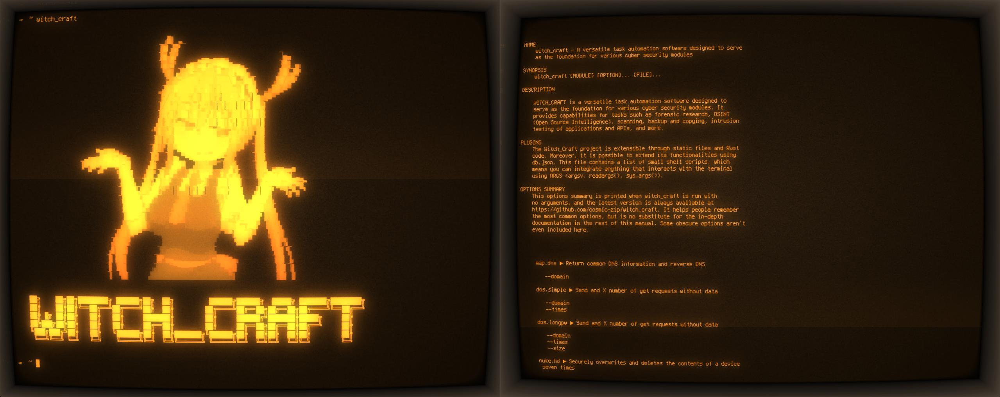

<center>
  <br>
    <h1>WITCH_CRAFT</h1>
  <br>
</center>

<center>
  🚧 Feel free to contribute to witch_craft by submitting issues or pull requests. 🚧
</center>
<hr>

### WITCH_CRAFT

WITCH_CRAFT is a versatile task automation software designed to serve as the
foundation for various cybersecurity modules. It provides capabilities for tasks
such as forensic research, OSINT (Open Source Intelligence), scanning, backup and
copying, intrusion testing of applications and APIs, and more.

### Visit the wiki:

https://cosmic-zip.github.io/wiki/wiki.html

### Plugins

The Witch_Craft project is extensible through static files and Rust code. Moreover, it is possible to extend its functionalities using `db.json`. This file contains a list of small shell scripts, which means you can integrate anything that interacts with the terminal using ARGS (argsv, readargs(), sys.args(), etc).

**Note**: There is a Python script called sort.py inside /var/witch_craft/witch_spells/dataset. It is used to create a sorted version of the dataset.

```json
{
  "description": "Securely deletes and overwrites the contents of a device seven times",
  "name": "nuke.hd",
  "command": "shred -vzn 7 @@device"
}
```

Thank you for your patience! Here’s the corrected section about the RC file, formatted clearly and without additional text:

````markdown
### RC File

To record logs of all your interactions, create a file named `.witchrc` in your home folder and add the following line to it:

```txt

path_log_file=~/my_frog.jsonl
```

You can use `~/` to represent your home directory or specify the complete path, such as:

```txt

path_log_file=/path/to/my/file.jsonl

```

### Instalation

The project initially includes a set of default files. These files
are created using the best possible data analysis techniques, and
their final versions are merged into the main project.

The witch_spells package also provide:

- **Unique Wordlists**:

  - _Moth_
  - _Ladybug_

- **Default Credentials Database**
- **IP Geolocation**
- **IP Reputation/Score**
- **A Set of Social Media Pages for Evil Twin Attacks**
- **General Wordlists for Directories and Subdomains**
- **MAC Address Vendor Database**
- **Usernames Wordlist**
- **XSS Wordlist**
- **And more, UwU!**

### Install using snap

<a href="https://snapcraft.io/witchcraft-cybersecurity">
  
</a>

### Build Instructions

To build the project, follow these instructions:

**Step 1: Clone the Repository**

```bash
git clone https://github.com/th3Maid/witch_craft.git --branch=trunk --depth 1
cd witch_craft
```

**Step 2: Run the Build Script**

Execute the provided build script build.sh:

```bash
chmod +x build.sh
./build.sh
```

The script will prompt you to enter the root password, create a folder called 'release,' and place the built executables inside it. Additionally, it will prompt you to run the commands for extracting the archive files for OSINT and wordlists. You can choose to extract one, both, or neither, but keep in mind that the archives are required for OSINT operations.

**Running Witch_Craft**

Execute the following command to run the witch_craft application:

```bash
witch_craft
```

**Note**: The first argument will always not have a "-" (minus) before it.

#### This script will run like:

```bash
witch_craft nuke.hd --device /dev/sdx1
```

```bash
witch_craft search.social --ip 172.16.0.1
```

```bash
witch_craft search.ipscore --ip 127.0.0.1
```

### License

<center>
  <div class="center">
    <b>This project is licensed under the GNU General Public License v3.0.</b>
  </div>
</center>

#### WITCH_CRAFT includes IP2Proxy LITE data available from https://www.ip2location.com/proxy-database

#### WITCH_CRAFT includes cinsscore data available from https://www.cinsscore.com
````
